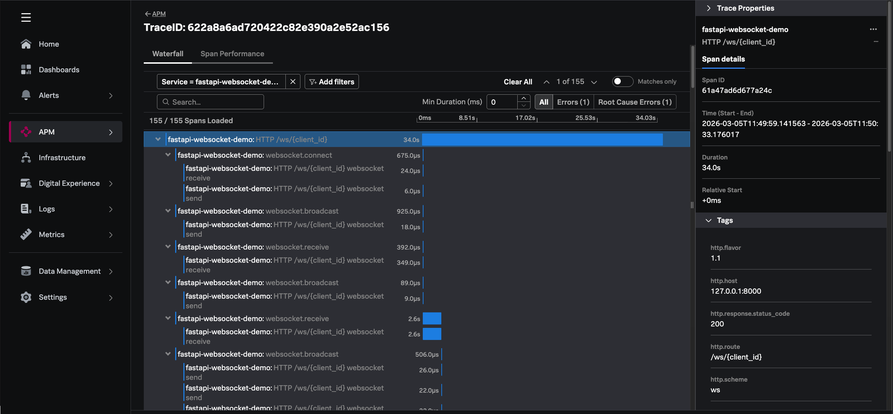

# FastAPI WebSocket Demo with OpenTelemetry → Splunk Observability Cloud

A ready-to-run Python application that demonstrates **WebSocket** communication
with [FastAPI](https://fastapi.tiangolo.com/) fully instrumented with
[OpenTelemetry](https://opentelemetry.io/), exporting **traces and metrics** to
[Splunk Observability Cloud](https://www.splunk.com/en_us/products/observability.html).

---

## What's Inside

| File | Purpose |
|---|---|
| `app/main.py` | FastAPI application with HTTP + WebSocket endpoints |
| `app/otel_config.py` | OpenTelemetry tracer & meter setup targeting Splunk O11y Cloud |
| `app/websocket_manager.py` | Connection manager with per-operation spans & custom metrics |
| `app/templates/index.html` | Browser-based chat UI (no build step needed) |
| `.env.example` | Template for required environment variables |
| `Dockerfile` / `docker-compose.yml` | Container-ready deployment |

---

## Telemetry Emitted

### Traces (Spans)

Every WebSocket lifecycle event creates a span:

| Span Name | Triggered When |
|---|---|
| `websocket.connect` | Client opens a WebSocket |
| `websocket.disconnect` | Client disconnects |
| `websocket.receive` | Server receives a message |
| `websocket.send_personal` | Server sends to one client |
| `websocket.broadcast` | Server broadcasts to all clients |

All HTTP routes (`/`, `/health`) are auto-instrumented by `opentelemetry-instrumentation-fastapi`.

### Metrics

| Metric | Type | Description |
|---|---|---|
| `websocket.connections.active` | UpDownCounter | Current number of open connections |
| `websocket.connections.total` | Counter | Cumulative connections since startup |
| `websocket.messages.sent` | Counter | Total messages sent |
| `websocket.messages.received` | Counter | Total messages received |
| `websocket.message.latency_ms` | Histogram | Broadcast processing time (ms) |
| `websocket.errors` | Counter | Errors during send/receive |

---

## Quick Start

### Prerequisites

- Python 3.10+
- A [Splunk Observability Cloud](https://www.splunk.com/en_us/products/observability.html) account
- A **Splunk Ingest Token** (Settings → Access Tokens → create one with *ingest* scope)

### 1. Clone & install

```bash
git clone https://github.com/markand4/splunk-observability-cloud-labs.git
cd splunk-observability-cloud-labs/labs/python-fastapi-websocket
python -m venv .venv && source .venv/bin/activate
pip install -r requirements.txt
```

### 2. Configure credentials (shared root `.env`)

```bash
# From the repo root
cp .env.example .env
```

Edit `.env` with your Splunk credentials:

```dotenv
SPLUNK_ACCESS_TOKEN=<your-ingest-token>
SPLUNK_REALM=us1
```

### 3. Run the app

```bash
# Source the shared creds + lab-specific settings
export $(grep -v '^#' ../../.env | xargs)
export OTEL_SERVICE_NAME=fastapi-websocket-demo
export OTEL_ENVIRONMENT=demo

# Start the server
uvicorn app.main:app --host 0.0.0.0 --port 8000 --reload
```

### 4. Open the chat UI

Navigate to **http://localhost:8000** in your browser.  
Open **multiple tabs** to simulate multiple chat participants — every connect,
message, and disconnect will generate traces and metrics.

### 5. Check Splunk O11y Cloud

- **APM → Traces**: Look for the service `fastapi-websocket-demo`. You'll see
  spans for WebSocket connect/disconnect/broadcast and HTTP requests.
- **Infrastructure → Metrics**: Search for `websocket.connections.active`,
  `websocket.messages.sent`, etc. to build dashboards.

---

## Example Trace in Splunk APM

Below is an example of what a WebSocket trace looks like in Splunk Observability Cloud APM after running the traffic generator:



**What you're seeing:**

- The root span `HTTP /ws/{client_id}` represents the full WebSocket session (34s in this example)
- Child spans show the lifecycle: `websocket.connect` → `websocket.receive` → `websocket.broadcast` (repeating for each message)
- Each `websocket.broadcast` includes nested `websocket send` spans — one per connected client
- Span tags include `http.route`, `http.scheme: ws`, `http.host`, and `http.response.status_code`
- 155 spans were captured in a single trace, giving full visibility into every message exchange

---

## Run with Docker

```bash
# Build and start
docker compose up --build

# Or manually
docker build -t fastapi-ws-otel .
docker run --env-file .env -p 8000:8000 fastapi-ws-otel
```

---

## Architecture Overview

```
┌──────────────┐   WebSocket (ws://)   ┌──────────────────────┐
│  Browser Tab  │◄────────────────────►│   FastAPI + Uvicorn   │
│  (Chat UI)    │                       │                      │
└──────────────┘                       │  ┌──────────────────┐ │
                                        │  │ Connection Mgr   │ │
┌──────────────┐   WebSocket (ws://)   │  │  (spans+metrics) │ │
│  Browser Tab  │◄────────────────────►│  └────────┬─────────┘ │
│  (Chat UI)    │                       │           │           │
└──────────────┘                       │  ┌────────▼─────────┐ │
                                        │  │ OTEL SDK         │ │
                                        │  │ TracerProvider    │ │
                                        │  │ MeterProvider     │ │
                                        │  └────────┬─────────┘ │
                                        └───────────┼───────────┘
                                                    │ OTLP/gRPC
                                        ┌───────────▼───────────┐
                                        │  Splunk Observability  │
                                        │  Cloud (APM + Metrics) │
                                        └────────────────────────┘
```

---

## Customization Tips

| Want to… | Do this |
|---|---|
| Change export interval | Edit `export_interval_millis` in `otel_config.py` |
| Add more custom metrics | Create new instruments in `websocket_manager.py` using the `meter` |
| Test without Splunk | Remove `SPLUNK_ACCESS_TOKEN`; telemetry stays local (logged warnings) |
| Add database tracing | `pip install opentelemetry-instrumentation-sqlalchemy` and call `SQLAlchemyInstrumentor().instrument()` |

---

## License

MIT — use freely for demos and customer engagements.
